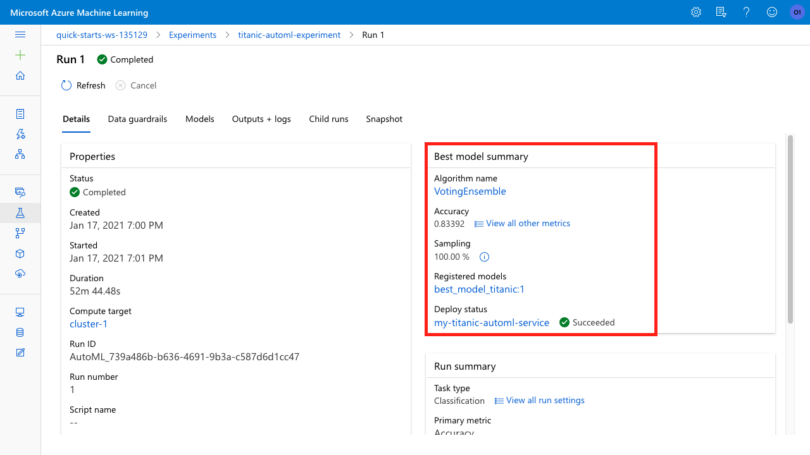
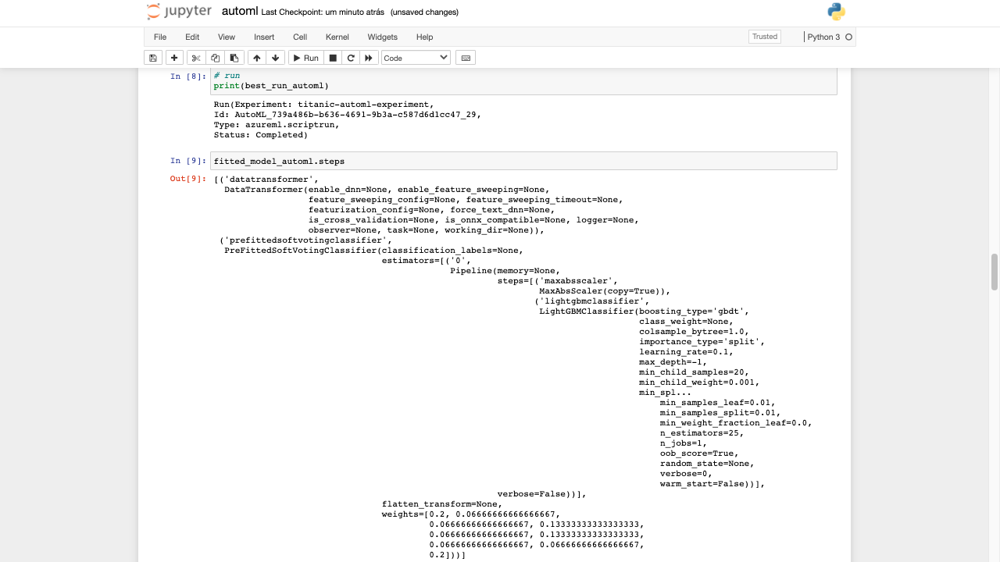
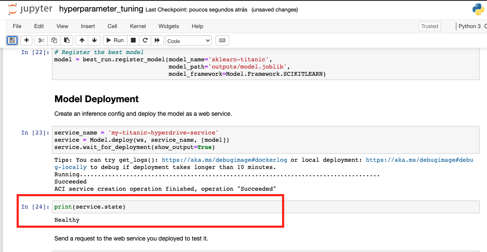

# Capstone - Azure Machine Learning Engineer
### Clarisse Ribeiro

In this project, we use the knowledge obtained in **Machine Learning Engineer with Microsoft Azure Nanodegree Program** to solve an interesting problem. 

The problem chosen is the [Kaggle Titanic Challenge](https://www.kaggle.com/c/titanic).  In the famous Titanic shipwreck, some passengers were more likely to survive than others. The dataset from Kaggle platform presents information about 871 passengers and a column that states if they have survived or not. The ultimate goal is to build a model predicts which passengers survived the Titanic shipwreck.

Here we do this in two different ways:
1) Using AutoML;
2) Using a customized model and tuning its hyperparameters with HyperDrive

We then compare the performance of both the models and deploy the best performing model.

## Dataset

### Overview

The dataset chosen for this project is the one from [Kaggle Titanic Challenge](https://www.kaggle.com/c/titanic). 

In the famous Titanic shipwreck, some passengers were more likely to survive than others. The dataset presents information about 871 passengers and a column that states if they have survived or not.

Here we use only the "training" data of the original challenge because this is the data with "Survived" label, which is necessary for the Supervised Learning algorithms that are used in this project.

Find below the data dictionary:

Variable | Definition | Key
------------ | ------------- | -------------
Survived | Survival | 0 = No, 1 = Yes
Nclass | Ticket class | 1 = 1st, 2 = 2nd, 3 = 3rd
Name | Name | name of the passenger (string)
Age	| Age | in years
Pibsp | # of siblings / spouses aboard the Titanic	| 
Parch | # of parents / children aboard the Titanic	| 
Ticket | Ticket number	| string
Fare | Passenger fare | Value (float)
Cabin | Cabin number |  string
Q | Port of Embarkation	is Q = Queenstown | 0 = No, 1 = Yes
S | Port of Embarkation	is S = Southampton | 0 = No, 1 = Yes
male | Is male. If not, we consider the passenger female. | 0 = No, 1 = Yes

The data has been uploaded [this repository](https://github.com/clasimoes/nd00333-capstone/blob/master/titanic_data/full_capstone.csv) for ease.

### Task
In this project we aim to create a model with the best possible **Accuracy** to classify if a passenger survives or not the shipwreck.
For this, we use two approaches:

1) **Using AutoML**:
In this approach, we provide the dataset to AutoML and it automatically does the featurization, try different algorithms and test the performance of many different models. 

2) **Using HyperDrive**: 
In this case, we test only a single algorithm and create different models by providing different hyperparameters. The chosen algorithm is Logistic Regression using the framework SKLearn.
Unlike AutoML, here we need to manually perform feature scaling, normalization and select interesting columns for our model.

In both cases, the best performing model created during runs can be saved and deployed, and its parameters can be checked both in Azure ML portal and in the run logs.

The features that are used in this experiment are the ones described in the data dictionary above. However, in the case of the HyperDrive, we manually remove the columns "Name", "Ticket" and "Cabin", which are not supported by the Logistic Regression classifier.

### Access

The data has been uploaded [this repository](https://github.com/clasimoes/nd00333-capstone/blob/master/titanic_data/full_capstone.csv) for ease.
In order to access it in our Azure notebooks, we need to download it from an external link into the Azure workspace.

For that, we can use the `Dataset` class, which allows importing tabular data from files in the web.
With that, we become able to create and register a dataset in Azure ML Platform and convert it to a Pandas Dataframe.

```python
    # Create AML Dataset and register it into Workspace
    example_data = 'https://raw.githubusercontent.com/clasimoes/nd00333-capstone/master/titanic_data/full_capstone.csv'
    dataset = Dataset.Tabular.from_delimited_files(example_data)
    #Register Dataset in Workspace
    dataset = dataset.register(...)
```


## Automated ML
For the AutoML run, first we create a compute cluster to run the experiment. In this cluster, we provise 2-10 machines with the **"STANDARD_DS12_V2"** configuration.
Because we have 10 nodes in our cluster, we are able to run up to 9 concurrent iterations in our experiment (1 node is meant to be used by the "parent" experiment).

The constructor of `AutoMLConfig` class takes the following parameters:
* `compute_target`: cluster where the experiment jobs will run;
* `task`: type of ML problem to solve, set as `classification`;
* `experiment_timeout_minutes`: 20;
* `training_data`: the dataset loaded; 
* `label_column_name`: The column that should be predicted, which is the "Survived" one; 
* `path`: the full path to the Azure Machine Learning project folder; 
* `enable_early_stopping`: the dataset loaded; 
* `featurization`: indicator that featurization step should be done automatically;
* `debug_log`: The log file to write debug information to; 
* `automl_settings`: other settings passed as a dictionary. 
    * `max_concurrent_iterations`: Represents the maximum number of iterations that would be executed in parallel. Set to 9;
    * `primary_metric`: The metric that Automated Machine Learning will optimize for model selection. We chose to optimize for `Accuracy`.


### Results
Among 100 experiments included in the AutoML, the best model produced relied on the **Voting Ensemble** algorithm, from the SKLearn framework. This model had an **accuracy** of **83,84%**.
The parameters used by this classifier are the following:

* n_jobs=1
* nthread=None
* objective='reg:logistic'
* random_state=0
* reg_alpha=1.6666666666666667
* reg_lambda=1.4583333333333335
* scale_pos_weight=1
* seed=None
* silent=None
* subsample=1
* tree_method='auto'

To improve the AutoML algorithm even further, we could choose the best 3 to 5 algorithms that performed well in this classification task and create another AutoML run forbidding any other type of algorithm.
We could also take a look in the data that has been wrongly classified by the best model and try to idenficate a pattern that points to transformations that we can perform in the dataset. This could be done by creating a pipeline with a first step to transform the data and second one to execute the AutoML.

Find below the screenshots of the AutoML run details widget, together with the best run details in the Azure ML platform and its properties in the Jupyter notebook.

#### AutoML Run Details widget


#### AutoML Best Model Run


#### AutoML Best Model Run Properties



## Hyperparameter Tuning
Here we are using a Logistic Regression model coming from the SKLearn framework to classify if a passenger would survive or not in the Titanic shipwreck.
Although logistic regression assumes a linear relationship between input and output, which is rarely the real case, it is easy to implement, interpret, and very efficient to train and classify unknown records.
So, this algorithm has been chosen because it would allow us to experiment quickly in the Azure ML environment.

Hyperdrive is used to sample different values for two algorithm hyperparameters:
* "C": Inverse of regularization strength
* "max_iter": Maximum number of iterations taken for the solvers to converge

My choice here was to sample the values using Random Sampling, in which hyperparameter values are randomly selected from the defined search space. "C" is chosen randomly in uniformly distributed between **0.001** and **1.0**, while "max_iter" is sampled from one of the three values: **1000, 10000 and 100000**.

### Results
Surprisingly, the best Logistic Regression model in the HyperDrive run performed even better than the best one of the AutoML run. This model had an **accuracy** of **85,20%**.

The parameters used by this classifier are the following:
* C = 0.8893892118773127
* Max iterations = 1000

To improve the Hyperdrive algorithm even further, we could have used regularization strenght as reference (it was randomly picked) and created a second HyperDrive run using a different sampling method using values closer to it.
Another strategy would be to test different classifier algorithms in our training script, and change their hyperparameters too. We could do that to a finite set of algorithms and hyperparameters and select the best one among all runs.

#### HyperDrive Run Details widget


#### HyperDrive Best Model Run


#### HyperDrive Best Model Run Properties


## Model Deployment
The model created by the HyperDrive has been deployed in an endpoint that can be accessed using the following REST API:
`http://01b44a8b-d762-47c0-af37-16bc6cdf52aa.southcentralus.azurecontainer.io/score`

The expected input type consists in a json with the following format:
```json
"data":
        [
          {
            "PassengerId": integer,
            "Pclass": integer,
            "Age": float,
            "SibSp": integer,
            "Parch": integer, 
            "Fare": float,
            "Q": integer,
            "S": integer,
            "male": integer
          }
        ]
```

To query it with a simple input, the anyone can mock the following python code:
```python
import requests
import json

scoring_uri = 'http://01b44a8b-d762-47c0-af37-16bc6cdf52aa.southcentralus.azurecontainer.io/score'

data = {"data":
        [
          {
            "PassengerId": 812,
            "Pclass": 2,
            "Age": 23.0,
            "SibSp": 0,
            "Parch": 0, 
            "Fare": 13.0,
            "Q": 0,
            "S": 1,
            "male": 1
          }
        ]
       }

# Convert to JSON string
input_data = json.dumps(data)
# Set the content type
headers = {'Content-Type': 'application/json'}
# Make the request and display the response
resp = requests.post(scoring_uri, input_data, headers=headers)
print(resp.json())
```

#### Service of HyperDrive model with "Active" deployment state


## Screen Recording
https://drive.google.com/file/d/1-DRqQ1hwh7izFWY5uOYBsdrsliRKAMXF/view?usp=sharing
